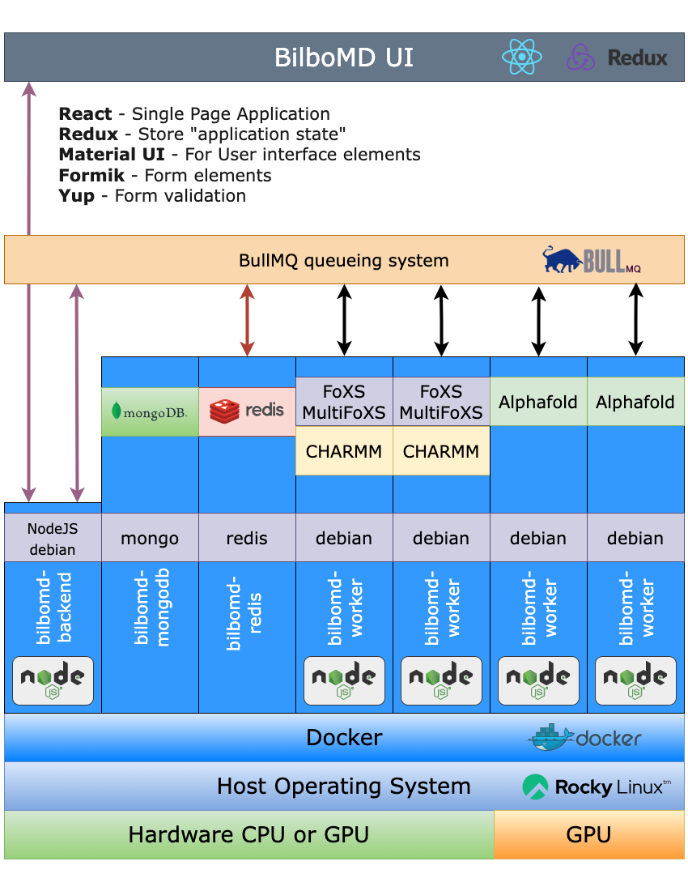

# bilbomd

This repository is a sort fo "wrapper" project. The main purpose is to hold the `docker-compose.yml` file. It will also serve as a place to document how to deploy BilboMD. Eventually I would like to explore converting the entire thing to a monorepo.

## Description

BilboMD is a webapp developed at the SIBYLS beamline. It uses Molecular Dynamics from [CHARMM](https://academiccharmm.org/) to generate aa array of possible molecular models. This ensemble of possible models is then used to calculate theoretical SAXS curves using [FoXS](https://modbase.compbio.ucsf.edu/foxs/about), compared with empirical SAXS data using [MultiFoXS](https://modbase.compbio.ucsf.edu/multifoxs/about) to find an ensemble of models that best explains your SAXS data.

## High level architecture



## Technology Stack

One of the major goals of the redesign of BilboMD was to modernize the various technologies used by the webapp. I'll just summarize them here:

### backend

- [![NodeJS][NodeJS]][NodeJS-url]
- [![MongoDB][MongoDB]][MongoDB-url]
- [![ExpressJS][ExpressJS]][ExpressJS-url]
- [![Docker][Docker]][Docker-url]
- [![Redis][Redis]][Redis-url]
- [BullMQ][BullMQ-url]

### frontend

- [Vite][Vite-url]
- [React][React-url]
- [Redux][Redux-url]
- [Material UI][MUI-url]
- [Yup][YUP-url]
- [Formik][Formik-url]

## Deployment

Deploying BilboMD web app currently requires a couple of steps. These instructions are assuming you will deploy on `hyperion`, but the code should be very portable.

## The `.env` file

The `.env` file can be created from the `.env_example` file and contains all the secrets needed to deploy BilboMD. To create the access `ACCESS_TOKEN_SECRET` and `REFRESH_TOKEN_SECRET` cryptographic keys just launch an interactive `node` terminal and type the following command:

```bash
require('crypto').randomBytes(64).toString('hex')
```

There are a number of other environment variables specified in the `.env` file that are needed by the various docker services/containers outlined below. They should be fairly self explanitory.

## 1. Build and deploy the backend Docker services

You must have the ability to start docker containers on the machine where you want to run BilboMD. The `docker-compose.yml` file specifies 6 services:

- bilbomd-ui
- bilbomd-backend
- bilbomd-worker
- bilbomd-scoper
- bilbomd-mongodb
- bilbomd-redis

### [bilbomd-ui][bilbomd-ui]

This is the ReactJS SPA ([Single Page Application](https://en.wikipedia.org/wiki/Single-page_application)) frontend app. All API traffic to `bilbomd-backend` is proxied through the nginx server that serves `bilbomd-ui`.

### [bilbomd-backend][bilbomd-backend]

This is the main NodeJS backend that handles the non-computational-related app functions. It performs authentication, authorization, retrieves job info from the main MongoDB database, user management, cookies, etc. We expose port `3500` so that other docker containers in the docker app-network can communicate with it. See the `Dockerfile` in the `bilbomd-backend` [repo][bilbomd-backend] for details.

### [bilbomd-worker][bilbomd-worker]

This is the docker container where the actual BilboMD computations are performed. It is built on a `debian:bullseye base` image. It also has CHARMM (version is specified in the `.env` file) and IMP baked in. See the `Dockerfile` in the `bilbomd-worker` [repo][bilbomd-worker] for details.

### [bilbomd-scoper][bilbomd-scoper]

This service provides the Scoper pipeline for predeciting Mg++ ion positions in RNA with best fitting to experimental SAXS data.

### bilbomd-redis

This service uses the default [Redis Docker image](https://hub.docker.com/_/redis). `bilbomd-redis` is a straight forward Redis docker container. No Docker file is required to build it. Redis (Remote Dictionary Server) is required by the BullMQ queueing system to store queue item information. We expose port `6379` so that other docker containers in the docker app-network can communicate with it.

### bilbomd-mongodb

This service uses the default [MongoDB Docker image](https://hub.docker.com/_/mongo). `bilbomd-mongodb` hosts the main database for BilboMD. It's quite simple at the moment with only 2 "tables" ; one for users and one for jobs. The details for these can be found in `bilbomd-backend/model/Job.js` and `bilbomd-backend/model/User.js`. This docker container requires port `27017` to be exposed.

## Docker compose instructions

There are still a lot of things I don't fully understand about Docker and Docker Compose. Here are a few useful links to the Docker documentation.

- [Docker Compose](https://docs.docker.com/compose/reference/)
- [Dockerfile](https://docs.docker.com/engine/reference/builder/)
- [Docker CLI](https://docs.docker.com/engine/reference/commandline/cli/)

### Checkout the top level `bilbomd` repo

```bash
cd directory/where/you/want/to/work
git clone git@github.com:bl1231/bilbomd.git
```

### Check out the other repos

```bash
cd bilbomd
git clone git@github.com:bl1231/bilbomd-ui.git
git clone git@github.com:bl1231/bilbomd-backend.git
git clone git@github.com:bl1231/bilbomd-worker.git
git clone git@github.com:bl1231/bilbomd-scoper.git
```

### The `docker-compose.yml` file

The `docker-compose.yml` file has many options which in general can be read about [here](https://docs.docker.com/compose/compose-file/03-compose-file/). The Compose file is a YAML file defining services, networks, volumes, configs and secrets. Here are the relevent links to the documentation.

- [services](https://docs.docker.com/compose/compose-file/05-services/)
- [networks](https://docs.docker.com/compose/compose-file/06-networks/)
- [volumes](https://docs.docker.com/compose/compose-file/07-volumes/)
- [configs](https://docs.docker.com/compose/compose-file/08-configs/)
- [secrets](https://docs.docker.com/compose/compose-file/09-secrets/)

### Docker Compose Commands for Production and Development

The production instructions are primarily desinged for deploying on `hyperion` at the SIBYLS beamline. There are separate instructions for deploying to SPIN at NERSC.

#### Production Commands

1. **Building the Production Instance**:

   ```bash
   export GIT_HASH=$(cat bilbomd-ui/git-hash.txt)
   docker compose -f docker-compose.yml -p bilbomd-prod build
   ```

   - The first command setting `GIT_HASH` env variable is so the git has can be displayed in the footer of the frontend app.
   - `-f docker-compose.yml`: Designates the Docker Compose configuration file to use.
   - `-p bilbomd-prod`: Sets the project name to differentiate Docker objects.
   - `build`: Instructs Docker Compose to build all images for defined services.

2. **Starting the Production Instance**:

   ```bash
   docker compose -f docker-compose.yml -p bilbomd-prod up -d
   ```

   - The first command setting `GIT_HASH` env variable is so the git has can be displayed in the footer of the frontend app.
   - The parameters are consistent with the build command.
   - `up -d`: Brings up the containers in detached mode.

#### Development Commands

These commands can be run on your laptop or some other development machine. Until I figure out a better way to include the git hash in the footer please run this command in `bilbomd-ui`:

```bash
echo "$(git rev-parse --short HEAD)" > git-hash.txt
```

1. **Building the Development Instance**:

   ```bash
   export GIT_HASH=$(cat bilbomd-ui/git-hash.txt)
   docker compose -f docker-compose.yml -f docker-compose.dev.yml -p bilbomd-dev build
   ```

   - The first command setting `GIT_HASH` env variable is so the git hash can be displayed in the footer of the frontend app.
   - `-f docker-compose.yml -f docker-compose.dev.yml`: Combines the base and development-specific Docker Compose files.
   - `-p bilbomd-dev`: Assigns a unique project name for the development environment.
   - `build`: Command to build the images.

2. **Starting the Development Instance**:

   ```bash
   docker compose -f docker-compose.yml -f docker-compose.dev.yml -p bilbomd-dev up -d
   ```

   - The parameters mirror the development build command.
   - `up -d`: Starts the containers in the background.

---

#### Additional Notes

- **Project Names (`-p`)**: Different project names (`bilbomd-prod` for production and `bilbomd-dev` for development) ensure that containers, networks, and volumes are separate and there's no overlap between environments.

- **Compose File Overrides**: The use of `docker-compose.dev.yml` in development allows for extending or overriding configurations in a manner specific to the development environment.

These commands are structured to manage separate development and production environments effectively in Docker Compose, ensuring a clear distinction and reliable deployment process.

---

### Check that BilboMD services are running and "healthy"

You can do this with the `docker ps` command. For example:

```bash
CONTAINER ID   IMAGE                          COMMAND                  CREATED        STATUS                  PORTS                      NAMES
3723ec63329a   bl1231/bilbomd-ui:1.8.2        "/docker-entrypoint.…"   6 hours ago    Up 6 hours              0.0.0.0:3001->80/tcp       bilbomd-prod-ui-1
b46d96d48861   bl1231/bilbomd-worker:1.5.2    "npm start"              11 hours ago   Up 11 hours                                        bilbomd-prod-worker-1
2170e019b8da   bl1231/bilbomd-backend:1.8.2   "docker-entrypoint.s…"   11 hours ago   Up 11 hours             0.0.0.0:3501->3500/tcp     bilbomd-prod-backend-1
643781e4caa4   bl1231/bilbomd-worker:1.5.2    "npm start"              11 hours ago   Up 11 hours                                        bilbomd-prod-worker-2
bb14f20dd1cd   bl1231/bilbomd-scoper:1.0.4    "npm start"              29 hours ago   Up 29 hours                                        bilbomd-prod-scoper-1
ccb9de30921f   mongo:7.0.7                    "docker-entrypoint.s…"   29 hours ago   Up 29 hours (healthy)   0.0.0.0:28017->27017/tcp   bilbomd-prod-mongodb-1
27eaae2fb95a   redis:7.2.4                    "docker-entrypoint.s…"   29 hours ago   Up 29 hours (healthy)   0.0.0.0:7379->6379/tcp     bilbomd-prod-redis-1
```

---

## 2. Deploy the BilboMD front end UI

_note:_ There are different instructions for running `bilbomd-ui` in development mode which I will write up later. This information and these instructions are geared towards the "production" instance of `bilbomd-ui`.

### Background

**BilboMD** will be served from [https://bilbomd.bl1231.als.lbl.gov](https://bilbomd.bl1231.als.lbl.gov). This domain points to Cloudflare which then points back to the beamline gateway machine at `bl1231-local.als.lbl.gov` which then [NAT](https://en.wikipedia.org/wiki/Network_address_translation)s all 80/443 traffic to our main webserver which is running Apache httpd. Our Apache server `www.bl1231.als.lbl.gov` is configured to provide name-based virtual hosting. Essentially a single httpd process that can serve multiple websites (e.g. our main Wordpress site at `bl1231.als.lbl.gov`, out GitLab server at `git.bl1231.als.lbl.gov`, and now bilbomd at `bilbomd.bl1231.als.lbl.gov`).

Although the main Apache server is running on a dedicated machine `www.bl1231.als.lbl.gov` we make extensive use of `ProxyPass` and `ProxyPassReverse` to connect to backend servers of various types.

### Apache VirtualHost configuration

I'm not going to go into extensive description of the Apache setup at 12.3.1, but here is a snippet from the config files that pertains to **BilboMD**.

```bash
<VirtualHost *:443>
    ServerName bilbomd.bl1231.als.lbl.gov
    ServerAdmin  sclassen@lbl.gov

    # LOGGING
    ErrorLog logs/bilbomd-error.log
    TransferLog logs/bilbomd-access.log

    # PROXY TO BACKEND SERVER
    ProxyPass "/" "http://hyperion.bl1231.als.lbl.gov:3001/"
    ProxyPassReverse "/" "http://hyperion.bl1231.als.lbl.gov:3001/"

    # SSL SETTINGS
    # self signed certs which should be fine for use with Cloudflare
    # look in the git@git.bl1231.als.lbl.gov:sa/sibyls-ansible-stuff.git
    # for the CSRs etc. in roles/openldap25/files/certs
    SSLEngine on
    SSLCertificateFile /etc/httpd/certs/bilbomd.crt
    SSLCertificateKeyFile /etc/httpd/certs/bilbomd.key
    SSLCertificateChainFile /etc/httpd/certs/BL-1231-CA.crt
</VirtualHost>
```

So from this you can probably figure out that any requests to `bilbomd.bl1231.als.lbl.gov` will be forwarded to port `3001` on `hyperion.bl1231.als.lbl.gov`. In general we don't want to run webapps as the root user or as our personal linux accounts, so I've set up a special service account (`webadmin`) that we can run webapps under.

### Checkout the `bilbomd-ui` code

Check out the frontend UI repo from GitHub:

```bash
git clone git@github.com:bl1231/bilbomd-ui.git
```

### Get a few onetime things prepared

### Install [nvm](https://github.com/nvm-sh/nvm)

```bash
curl -o- https://raw.githubusercontent.com/nvm-sh/nvm/v0.39.7/install.sh | bash
```

Logout and back in. [NVM Documentation](https://github.com/nvm-sh/nvm#table-of-contents)

### Then use `nvm` to install NodeJS

```bash
nvm install --lts
nvm use --lts
```

You might need to logout and back in. You can also create a [`.nvmrc`](https://github.com/nvm-sh/nvm#nvmrc) file to define the version of NodeJS that you want to use in a particular directory.

## Versioning

We use npm to increment the version in package.json

<https://docs.npmjs.com/cli/v9/configuring-npm/package-json#version>

For example:

```bash
npm version 0.0.7
```

This will perform 2 actions:

1. creates a git tag "v0.0.7"
2. increment the "version" field in the `package.json` file

Then we manually increment the "tag" in `docker-compose.yml` so that the next time we run "build" we get a docker image that is tagged the same as the git tag. There might be a more elegant way to do this, but for now this is the way.

for example in the `docker-compose.yml` file:

```bash
worker:
   image: bl1231/bilbomd-worker:0.0.7
```

Then when we run docker compose it will essentially build an image based on whatever branch is currently checked out, tag it, and then - if you run "up -d", it will be deployed. So it seems important to make sure that you have the correct git tag checked out before running any docker commands.

or at least be aware that when updating the production docker images you should have all projects checked out at "main"

The docker development environment mounts the entire app directory in the docker container so that we can do interactive nodemon development

<!-- MARKDOWN LINKS & IMAGES -->
<!-- https://www.markdownguide.org/basic-syntax/#reference-style-links -->

[React-url]: https://reactjs.org/
[MongoDB]: https://img.shields.io/badge/MongoDB-%234ea94b.svg?style=for-the-badge&logo=mongodb&logoColor=white
[MongoDB-url]: https://www.mongodb.com/
[NodeJS]: https://img.shields.io/badge/node.js-6DA55F?style=for-the-badge&logo=node.js&logoColor=white
[NodeJS-url]: https://nodejs.org/
[ExpressJS]: https://img.shields.io/badge/express.js-%23404d59.svg?style=for-the-badge&logo=express&logoColor=%2361DAFB
[ExpressJS-url]: https://expressjs.com/
[Redis]: https://img.shields.io/badge/redis-%23DD0031.svg?style=for-the-badge&logo=redis&logoColor=white
[Redis-url]: https://redis.io/
[Docker]: https://img.shields.io/badge/docker-%230db7ed.svg?style=for-the-badge&logo=docker&logoColor=white
[Docker-url]: https://www.docker.com/
[BullMQ-url]: https://docs.bullmq.io/
[Vite-url]: https://vitejs.dev/
[Redux-url]: https://redux.js.org/
[MUI-url]: https://mui.com/
[Formik-url]: https://formik.org/
[YUP-url]: https://github.com/jquense/yup
[bilbomd-worker]: https://github.com/bl1231/bilbomd-worker
[bilbomd-backend]: https://github.com/bl1231/bilbomd-backend
[bilbomd-scoper]: https://github.com/bl1231/bilbomd-scoper
[bilbomd-ui]: https://github.com/bl1231/bilbomd-ui
