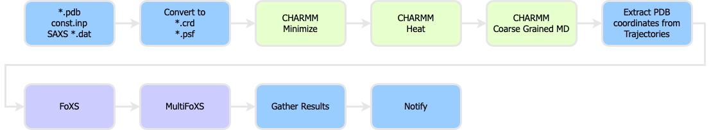
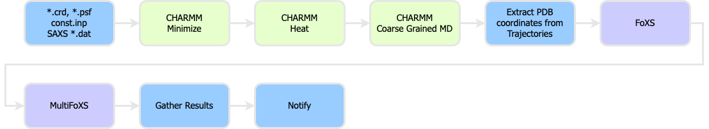

# BilboMD

An advances Small Angle X-Ray Scattering (SAXS) modelling pipeline.

## Description

BilboMD is a webapp developed at the [SIBYLS beamline](https://sibyls.als.lbl.gov). It uses Molecular Dynamics from [CHARMM](https://academiccharmm.org/) or [OpenMM](https://openmm.org/) to generate an array of possible molecular models. The ensemble of models is used to calculate theoretical SAXS curves using [FoXS](https://modbase.compbio.ucsf.edu/foxs/about), and compared with experimental SAXS data using [MultiFoXS](https://modbase.compbio.ucsf.edu/multifoxs/about) to find an ensemble of models that best explains your SAXS data.

## Pipelines

There are several different SAXS modeling pipelines available.

### BilboMD Classic w/PDB inputs

This pipeline offers the classic BilboMD from years past where you can upload a custom `const.inp` file and adjust the `rg_min` and `rg_max` values. It takes a user provided PDB file and experimental SAXS data.

### BilboMD Classic w/CRD inputs

This pipeline offers the classic BilboMD from years past where you can upload a custom `const.inp` file and adjust the `rg_min` and `rg_max` values. It takes a user provided CRD and PSF file and experimental SAXS data. The CRD and PSF files can be generated using [CHARMM GUI](https://www.charmm-gui.org/).

### BilboMD Auto

This pipeline is designed to take Alphafold models and a Per residue Alignment Error (PAE) matrix in combination with your experimental SAXS data.

### BilboMD AF

This pipeline is designed to run Alphafold2 on your provided protein sequence and then run the Auto pipeline above.

## Test Coverage

Current test coverage across BilboMD apps:

<!-- COVERAGE-TABLE:START -->
| App | Statements | Branches | Functions | Lines |
|-----|-----------|----------|-----------|-------|
| Backend | 80.00% | 64.15% | 71.73% | 80.50% |
| UI | 65.58% | 55.56% | 62.64% | 67.16% |
| Worker | 82.40% | 71.34% | 83.09% | 82.48% |
| Scoper | N/A | N/A | N/A | N/A |
<!-- COVERAGE-TABLE:END -->

*Coverage is automatically updated on each push to main.*

## Deployment

There are 2 instances of BilboMD available. Each deployment has a different selection of pipelines available. This is primarily because of access to high performance NVIDIA GPUs at NERSC which are unavailable at the SIBYLS beamline on Hyperion.

1. Hyperion [https://bilbomd.bl1231.als.lbl.gov](https://bilbomd.bl1231.als.lbl.gov)

    - Classic w/PDB
    - Classic w/CRD
    - Auto
    - Multi
    - SANS
    - Scoper

2. NERSC [https://bilbomd-nersc.bl1231.als.lbl.gov](https://bilbomd-nersc.bl1231.als.lbl.gov)

    - Classic w/PDB
    - Classic w/CRD
    - Auto
    - AF
